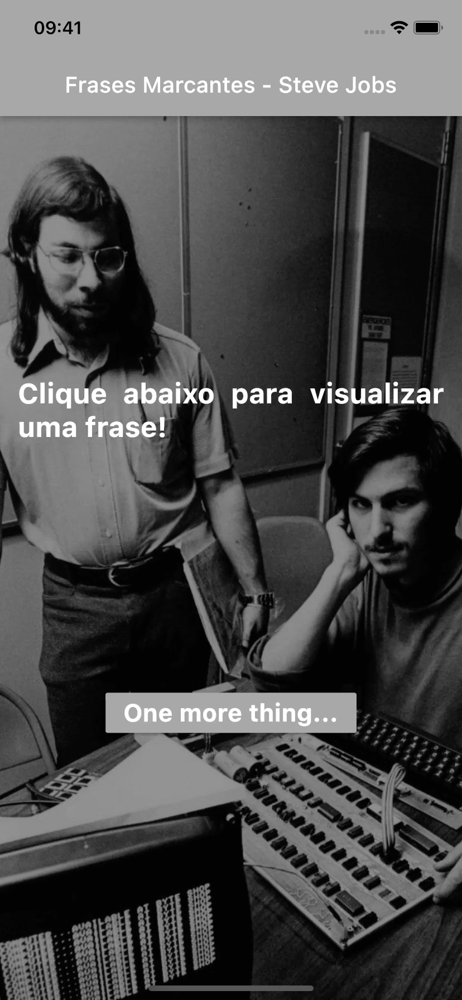

# Frases Marcantes - Steve Jobs
> Meu Primeiro App utilizando o Framework Flutter.

Projeto para estudo do framework Flutter e da linguagem Dart.

Exibe uma compilação das consideradas 20 melhores frases ditas por Steve Jobs segundo John Brandon, editor da revista Inc.

Conteúdo estudado e implementado neste App: introdução ao material design, estrutura de projeto Flutter, container, colunas/linhas, formatação de texto, botões, espaçamentos/alinhamentos, imagens, base scaffold e widgets statefull/stateless.

## Screen Recording Android:

## Screen Recording iOS:

## Histórico de Atualizações:  

* 20221106:
    * Código refeito do zero para assimilar o conteúdo de estrutura de projeto Flutter e componentes de interface.
* 20221102:
     * Projeto inicial: baseado no projeto demo do Flutter, modificado para receber um vetor com 10 frases marcantes do Steve Jobs. O botão flutuante recebe um número aleatório correspondente ao número de frases, acessa o vetor e altera o conteúdo da tela.

## Links:

[https://github.com/danielperesjr/PrimeiroAppFlutter](https://github.com/danielperesjr/PrimeiroAppFlutter)

[https://epocanegocios.globo.com/Inspiracao/Vida/noticia/2015/09/20-melhores-frases-de-steve-jobs.html](https://epocanegocios.globo.com/Inspiracao/Vida/noticia/2015/09/20-melhores-frases-de-steve-jobs.html)